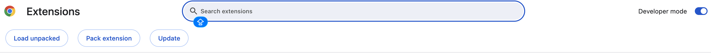
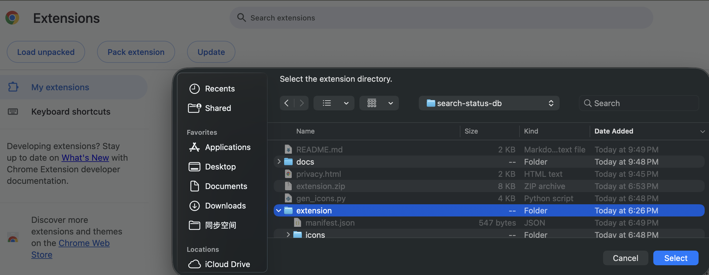
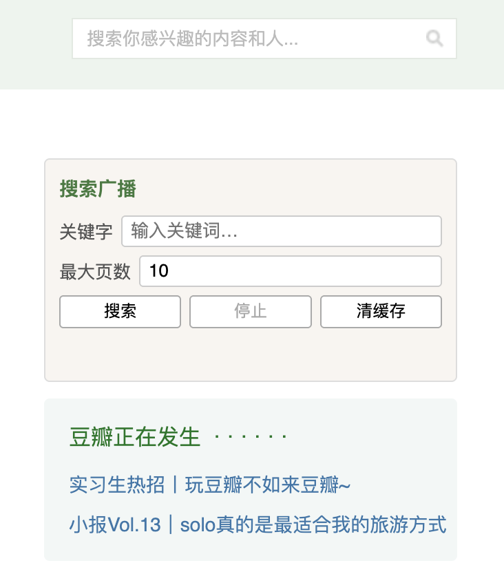
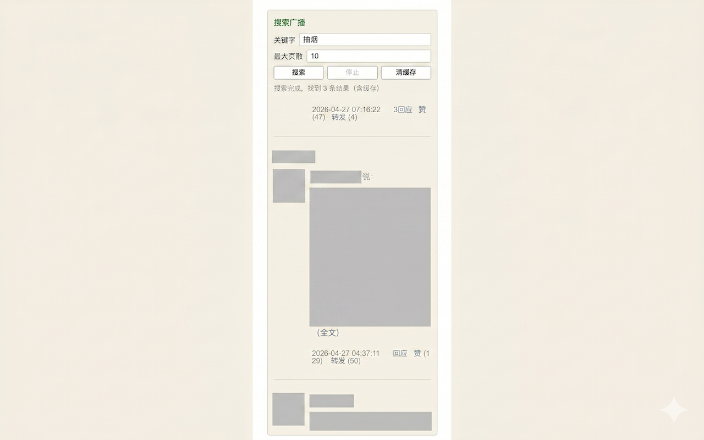

# 豆瓣广播搜索 · Douban Status Search

一个 Chrome 扩展，让你可以在豆瓣主页广播流中按关键字搜索历史广播。

---

## 功能介绍

- **关键字搜索**：在豆瓣主页 `https://www.douban.com/` 右侧边栏输入关键字，自动翻页抓取匹配的广播
- **分页控制**：可自定义最大搜索页数（默认 10 页），避免请求过多
- **本地缓存**：已抓取过的广播按 ID 缓存在浏览器本地，重复搜索时命中缓存直接返回，减少网络请求
- **停止 / 清缓存**：搜索过程中可随时停止；一键清除本地缓存

---

## 安装方法（开发者模式）

> 本扩展尚未上架 Chrome 应用商店，需通过开发者模式手动加载。

**第一步：下载源码**

点击页面右上角 **Code → Download ZIP**，解压到本地任意目录。

或使用 git 克隆：

```bash
git clone https://github.com/ChaoZaiOverload/search-status-db.git
```

**第二步：打开扩展管理页面**

在 Chrome 地址栏输入：

```
chrome://extensions/
```

**第三步：开启开发者模式**

点击页面右上角的 **开发者模式** 开关。



**第四步：加载扩展**

点击左上角 **加载已解压的扩展程序**，选择项目中的 `extension/` 文件夹。



安装成功后，工具栏会出现绿色搜索图标。

---

## 使用方法

1. 打开 `https://www.douban.com/`（需已登录）
2. 页面右侧边栏顶部会出现 **搜索广播** 面板
3. 输入关键字，设置最大页数，点击 **搜索**
4. 匹配结果实时显示在面板下方





---

## 注意事项

- 需保持豆瓣登录状态，扩展使用当前浏览器 Cookie 访问广播流
- 搜索速度受限于豆瓣接口，每页间隔约 1.5 秒，请勿设置过大页数
- 缓存存储在本地浏览器，卸载扩展后自动清除

---

## 隐私政策

[查看隐私政策](https://chaozaioverload.github.io/search-status-db/privacy.html)

---

## License

GPL 3.0
